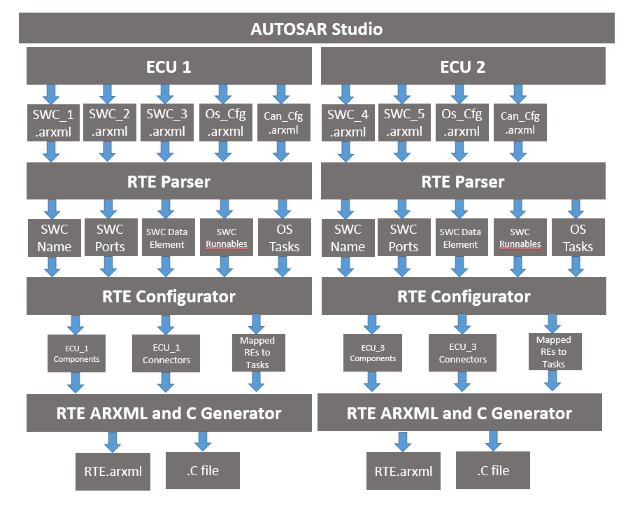
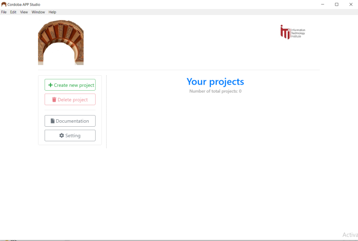

Cordoba APP Studio
====================
## Table of Contents
- [Intro](#intro)
- [Setup](#setup)
- [Knowledge](#knowledge)
- [Software Component ARXML Elements](#software-component-arxml-elements)
- [About Cordoba APP Studio](#About-Cordoba-APP-Studio)
- [Provided APP Updates](#Provided-APP-Updates)

## Intro

<h4 align="center">An open source educational tool for AUTOSAR Software components Design </h4>
Cordoba APP Studio Project is written with Web Technologies (HTML,CSS,JavaScript) and also electron framework to make it as Desktop Application

The aim of the software is to
Design Software Components Model and Change it to ARXML files (SWCs.ARXML ,DataTypeAndInterface.ARXML)

AUTOSAR Studio will try to extract the following information:

-  Software Components Standard Tags (AUTOSAR Release 4.3.1)
-  Composition DataTypeAndInterface Tags (AUTOSAR Release 4.3.1)

  

<h4 align="center">Block Diagram Describes the Different Phases of integration with Autosar Studio with RTE Tool</h4>

## Setup

Clone this repository on your machine.

    git clone https://github.com/mAbdelhay/Autosar_Studio.git
Open your terminal and navigate to the repo's directory.

    cd ./Autosar_Studio
Run electron installation command:    
    
    npm install --save-dev electron
    
Run start command to run the application:

    npm start
    

## Knowledge 
- What is AUTOSAR ?
    - AUTOSAR – AUTomotive Open Systems ARchitecture
        Middleware and system-level standard, jointly developed by
        automobile manufacturers, electronics and software suppliers
        and tool vendors.
    - It pursues the objective of creating and establishing an open and standardized software architecture for automotive electronic    control units
    - **“cooperate on standards, compete on implementations”**
- What is the software component (SWC)?
    
  - The software component is a piece of code that carries out an application or part of an application. In AUTOSAR, software components        are not limited to the application layer, i.e. they also exist in the RTE and BSW layer.
  - The AUTOSAR Software Components encapsulate an application which runs on the AUTOSAR infrastructure.
  
 - What is the basic structure of SWC?
    - Software Component Description
        * Ports
            * P-Ports: Provide Ports
            * R-Ports: Require Ports
            * PR-Ports: Provide Require Ports
        * Internal Behavior 
            * Runnables
            * Events
    - Implementation.
    
  - What are the ports’ interfaces?
    - Client-Server: The server provides services while one or more clients may use its services to carry out tasks when the operation invoked on a server uses arguments supplied by a client to perform the requested task.
    - Sender-Receiver: this way of communicating allows one receiver to get information from multiple senders or a sender to send information to an arbitrary number of receivers.
    
  - What is the runnable?
    - A runnable entity is the smallest code fragment inside a SWC. It is these Runnables that are mapped to OS tasks and will execute the behavior of the SWC. 
        
  - What is ARXML?
    - ARXML files are a type of files used across AUTOSAR, to author and configure the AUTOSAR software.
    - ARXML stands for AUTOSAR XML, which is nothing but a schema with certain parameters, this schema is provided by AUTOSAR to standardize the process & increase portability.
    
## Software Component ARXML Elements

- AUTOSAR Tags

    - Define Autosar XML schema version
    
          <AUTOSAR 
                xsi:schemaLocation="http://autosar.org/schema/r4.0 AUTOSAR_4-3-0.xsd" 
                xmlns="http://autosar.org/schema/r4.0" xmlns:xsi="http://www.w3.org/2001/XMLSchema-instance">
                <AR-PACKAGES>
                        ....
                </AR-PACKAGES>
          </AUTOSAR>
         
- Top Level Packages (AR-PACKAGES)

    - This element is the container of all AUTOSAR packages that are added into the file.
    
            <AR-PACKAGES>
                <AR-PACKAGE>
                </AR-PACKAGE>
                <AR-PACKAGE>
                </AR-PACKAGE>
                .
                .
                .
            </AR-PACKAGES>
- AR-PACKAGE 

   - AUTOSAR Package containing package name , Software components and Their structure  
        
            <AR-PACKAGE>
                <SHORT-NAME>PackageName</SHORT-NAME>
                <ELEMENTS>
                    <APPLICATION-SW-COMPONENT-TYPE>
                        .......
                    </APPLICATION-SW-COMPONENT-TYPE>
                    <SWC-IMPLEMENTATION>
                        .......
                    </SWC-IMPLEMENTATION>
                 </ELEMENTS>
            </AR-PACKAGE>
- Software Component (Application - Service - Complex Device Drived)

    - This element describes the software component and its ports.
        
            <APPLICATION-SW-COMPONENT-TYPE>
                <SHORT-NAME>SWC_Name</SHORT-NAME>
                <PORTS>
                    .......
                </PORTS>
                <INTERNAL-BEHAVIORS>
                    .......
                </INTERNAL-BEHAVIORS>
            </APPLICATION-SW-COMPONENT-TYPE>
            
            or 
            
            <SERVICE-SW-COMPONENT-TYPE>
                <SHORT-NAME>SWC_Name</SHORT-NAME>
                <PORTS>
                    .......
                </PORTS>
                <INTERNAL-BEHAVIORS>
                    .......
                </INTERNAL-BEHAVIORS>
            </SERVICE-SW-COMPONENT-TYPE>
            
            or
            
            <COMPLEX-DEVICE-DRIVE-SW-COMPONENT-TYPE>
                <SHORT-NAME>SWC_Name</SHORT-NAME>
                <PORTS>
                    .......
                </PORTS>
                <INTERNAL-BEHAVIORS>
                    .......
                </INTERNAL-BEHAVIORS>
            </COMPLEX-DEVICE-DRIVE-SW-COMPONENT-TYPE>
            
    - Ports Types
        
         – PPort (provided port) or RPort (required port)
        
         – Interface provided (provided interface) or (required interface)
    
    
                <PORTS>
                    <P-PORT-PROTOTYPE>
                        <PROVIDED-COM-SPECS>
                            .....
                        </PROVIDED-COM-SPECS>
                    </P-PORT-PROTOTYPE>   
                    .
                    .
                    .
                    <R-PORT-PROTOTYPE>
                        <REQUIRED-COM-SPECS>
                            .......
                        </REQUIRED-COM-SPECS>
                    </R-PORT-PROTOTYPE>       
                    .
                    .
                    .
                    .
                </PORTS>
                
     - Internal Behavior
     
        - This element describes the behavior of the software component, including its Runnables and its events
        
        
               <INTERNAL-BEHAVIORS>
                    <SWC-INTERNAL-BEHAVIOR>
                        <SHORT-NAME>SWC_InternalBehaviorName</SHORT-NAME>
                            <EVENTS>
                                ......
                            </EVENTS>
                            <RUNNABLES>
                                .......
                            </RUNNABLES>
                     </SWC-INTERNAL-BEHAVIOR>   
                </INTERNAL-BEHAVIORS>
             
             
          - Events
                We implement Five event types ( Init , Timing , Data Recieved , Data Recieved Error , Operation Invoked )
                    that trig a runnable
                    
                    <EVENTS>
                          <INIT-EVENT>
                          </INIT-EVENT>
                          <TIMING-EVENT>
                          </TIMING-EVENT>
                          <DATA-RECEIVED-EVENT>
                          </DATA-RECEIVED-EVENT>
                          <DATA-RECEIVE-ERROR-EVENT>
                          </DATA-RECEIVE-ERROR-EVENT>
                          <OPERATION-INVOKED-EVENT>
                          </OPERATION-INVOKED-EVENT>
                    </EVENTS>
            
          - Runnables
                
                    <RUNNABLE-ENTITY>
                        <SHORT-NAME>RunnableName</SHORT-NAME>
                        <DATA-SEND-POINTS>
                        </DATA-SEND-POINTS>
                        <DATA-WRITE-ACCESSS>
                        </DATA-WRITE-ACCESSS>
                        <SERVER-CALL-POINTS>
                        </SERVER-CALL-POINTS>
                    </RUNNABLE-ENTITY>

## About Cordoba APP Studio

Cordoba APP Studio is The Last updated version of AUTOSAR Studio (Release 4.0)

  

<h4 align="center">Cordoba APP Studio</h4>

## Provided APP Updates

### Software Component

- Allows more SWC types Service SWC type, Complex Device Driver SWC type besides the Application SWC type.

### Data-Types

- Provides Implementation Data-Types as a reference for Data-Types.
- Implementation Data-Types as Structure , Array and Value.
- Every Element in Implementation Data-Types can either maps to Basic Software Data-Type or Implementation Data-Type.

### Port Interfaces

#### -Sender Receiver Port Interface 
- This element describes a sender/receiver interface that declares many data elements to be sent and received.
- The Data Element describes the variables associated with each interface. 
- Data Elements in the latest Release can only be Implementation Data-Type .
#### -Client Server Port Interface 
- This element describes a Client/Server interface that declares many Operations to be invoked and handled.
- Each Operation can have Arguments either input , output or input/output. 
- Arguments in the latest Release can only be Implementation Data-Type .

### Ports

#### -R-Port Prototype
- This element describes a Requester Port and it’s linked to an Interface.
#### -P-Port Prototype
- This element describes a Provider Port and it’s linked to an Interface.

### Internal Behavior

#### -Runnable
- Runnables are the callable function that are Triggered by certain events. These functions are the actual implementation for the functionalities of the SWC.
#### -Events
- This element describes an action that Trigger some functionalities.
- Events Trigger can be Init Event, Timing Event (S/R) interface, On Operation Invoked in (C/S) interface.   

